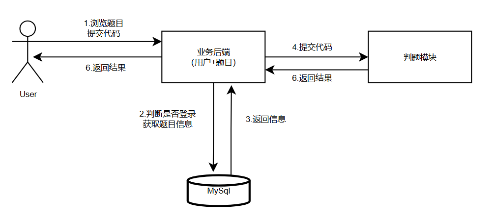
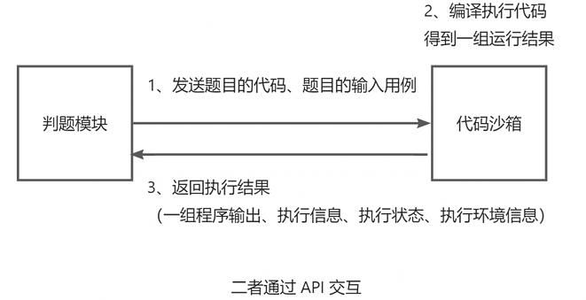

## 项目介绍

**在线判题系统：**用户可以选择题目，在线做题，编写代码并且提交代码；系统会对用户提交的代码，根据我们出题
人设置的答案，来判断用户的提交结果是否正确。

## 实现核心

1. 权限校验
2. **代码沙箱**

## 核心业务流程



**判题服务**：获取题目信息、预计的输入输出结果，返回给主业务后端：用户的答案是否正确
**代码沙箱：**只负责运行代码，给出结果，不管什么结果是正确的。

## 功能

1. 题目模块

   - 创建题目

   - 删除

   - 修改

   * 搜搜

   - 在线做题

   - 提交题目代码

2. 用户模块

   - 注册

   - 登录

3. 判题模块

   - 提交判题（结果正确与否）

   - 错误处理（内存溢出，安全性，超时）

   - 自主实现代码沙箱

   - 开放接口

## 判题机模块架构

判题模块：调用代码沙箱，把代码和输入交给代码沙箱去执行
代码沙箱：只负责接受代码和输入，返回编译运行的结果，不负责判题（可以作为独立的项目 / 服
务，提供给其他的需要执行代码的项目去使用）
这两个模块完全解耦：



## 代码沙箱架构开发

1. 定义代码沙箱的接口，提高通用性
   之后我们的项目代码只调用接口，不调用具体的实现类，这样在你使用其他的代码沙箱实现类时，
   就不用去修改名称了， 便于扩展。

2. 定义多种不同的代码沙箱实现

3. 编写单元测试，验证单个代码沙箱的执行

4. 使用工厂模式，根据用户传入的字符串参数（沙箱类别），来生成对应的代码沙箱实现类
   此处使用静态工厂模式，实现比较简单，符合我们的需求。
5. 参数配置化，把项目中的一些可以交给用户去自定义的选项或字符串，写到配置文件中。这样
   开发者只需要改配置文件，而不需要去看你的项目代码，就能够自定义使用你项目的更多功能。
   application.yml 配置文件中指定变量

​	在 Spring 的 Bean 中通过 @Value 注解读取

6. 代码沙箱能力增强
   比如：我们需要在调用代码沙箱前，输出请求参数日志；在代码沙箱调用后，输出响应结果日志，
   便于管理员去分析。

   代理模式的实现原理：
   1. 实现被代理的接口
   2. 通过构造函数接受一个被代理的接口实现类
   3. 调用被代理的接口实现类，在调用前后增加对应的操作

## 判题服务开发

### 判题服务业务流程

1. 传入题目的提交 id，获取到对应的题目、提交信息（包含代码、编程语言等）
2. 如果题目提交状态不为等待中，就不用重复执行了
3. 更改判题（题目提交）的状态为 “判题中”，防止重复执行，也能让用户即时看到状态
4. 调用沙箱，获取到执行结果
5. 根据沙箱的执行结果，设置题目的判题状态和信息

### 判题逻辑

1. 先判断沙箱执行的结果输出数量是否和预期输出数量相等
2. 依次判断每一项输出和预期输出是否相等
3. 判题题目的限制是否符合要求
4. 可能还有其他的异常情况

### 策略模式优化

我们的判题策略可能会有很多种，比如：我们的代码沙箱本身执行程序需要消耗时间，这个时间可能不同的编程语言是不同的

实现步骤如下：

1. 定义判题策略接口，让代码更加通用化

2. 定义判题上下文对象，用于定义在策略中传递的参数

3. 实现默认判题策略，先把 judgeService 中的代码搬运过来
4. 再新增一种判题策略，通过 if ... else ... 的方式选择使用哪种策略

5. 定义 JudgeManager，目的是尽量简化对判题功能的调用，让调用方写最少的代码、调用最简
   单。对于判题策略的选取，也是在 JudgeManager 里处理的。


## 代码沙箱

> 代码沙箱的定位：只负责接受代码和输入，返回编译运行的结果，不负责判题（可以作为独立的项
> 目 / 服务，提供给其他的需要执行代码的项目去使用） 

### Java 原生实现代码沙箱

**通过命令行执行：**接收代码=>编译代码=>执行代码

使用 ==-encoding utf-8==解决乱码问题

**统一类名为Main**

**核心实现流程：**用程序代替人工，用程序来操作命令行，去编译执行代码
**核心依赖：**Java 进程类 Process

1. 把用户的代码保存为文件

   新建目录，将每个用户的代码都存放在独立目录下，通过 UUID 随机生成目录名，便于隔离和维护
   
2. 编译代码，得到 class 文件
   
   执行 process.waitFor 等待程序执行完成，并通过返回的 exitValue 判断程序是否正常返回，然后
   从 Process 的输入流 inputStream 和错误流 errorStream 获取控制台输出
   
3. 执行代码，得到输出结果
   
   使用OutputStreamWriter、PrintWriter想Process终端输入数据
   
4. 收集整理输出结果

   1. 通过 for 循环遍历执行结果，从中获取输出列表
   2. 获取程序执行时间(StopWatch)
   3. 使用最大值来统计时间，判断程序是否超时

5. 文件清理，释放空间
   
6. 错误处理，提升程序健壮性

### Java 程序安全控制

1. 超时控制

   通过创建一个守护线程，超时后自动中断 Process 实现。

2. 限制资源分配
   
3. 限制代码-黑名单

   HuTool 工具库的字典树工具类：WordTree
   
4. 限制权限 - Java 安全管理器

   Java 安全管理器（Security Manager）是 Java 提供的保护 JVM、Java 安全的机制，可以实现更
   严格的资源和操作限制。
   编写安全管理器，只需要继承 SecurityManager。

### 代码沙箱-Docker实现

Docker 技术可以实现程序和宿主机的隔离。

镜像：用来创建容器的安装包，可以理解为给电脑安装操作系统的系统镜像
容器：通过镜像来创建的一套运行环境，一个容器里可以运行多个程序，可以理解为一个电脑实例
Dockerfile：制作镜像的文件，可以理解为制作镜像的一个清单
镜像仓库：存放镜像的仓库，用户可以从仓库下载现成的镜像，也可以把做好的镜像放到仓库里

#### Java 操作 Docker

```xml
<dependency>
    <groupId>com.github.docker-java</groupId>
    <artifactId>docker-java</artifactId>
    <version>3.3.0</version>
</dependency>
<!-- https://mvnrepository.com/artifact/com.github.docker-java/docker-java-tr
<dependency>
    <groupId>com.github.docker-java</groupId>
    <artifactId>docker-java-transport-httpclient5</artifactId>
    <version>3.3.0</version>
</dependency>
```

